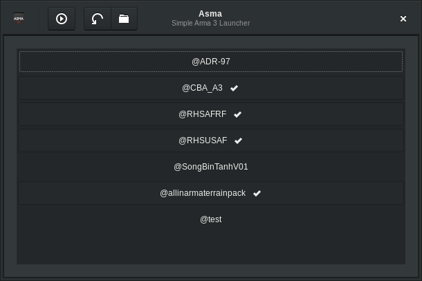

# [Asma](https://github.com/her001/asma)

Copyright © 2016, 2017 Andrew "HER0" Conrad

Copyright © 2016 Pau Busquets Aguiló

**Asma** is a simple Arma 3 launcher for Linux.



The primary purpose is to provide a GUI for selecting modifications to launch
the game with. In addition, some common game options can be toggled, which are
remembered between uses. Note that Asma may be functional on macOS, but this is
untested.

Asma is made available under the terms of the GNU GPL version 3. See `LICENSE`
for details.

## Requirements

* [Arma 3](http://store.steampowered.com/app/107410) (obviously)
* [GTK+ 3](https://www.gtk.org/download/index.php)
* [Meson](https://github.com/mesonbuild/meson/releases) ≥ 0.36.0 and [Ninja](https://github.com/ninja-build/ninja/releases) (for building and installing)

Any mods should be in the Arma 3 folder (linking works) and start with the "@"
character.

## Installation

The following are generic build instructions. For more specific instructions,
please visit the [wiki](https://github.com/her001/Asma/wiki/Build-Instructions).

First, clone the project and switch to the directory:

```
git clone https://github.com/her001/asma.git
cd asma
```

Next, configure and build:

```
meson builddir
cd builddir
ninja
```

Finally, install (as root):

```
ninja install
```

## Contributing

By participating in Asma, you agree to the terms set forth by the
Contributor Covenant. See `CODE_OF_CONDUCT.md` for details.

Issues or pull requests can be filed on the GitHub
[issue tracker](https://github.com/her001/asma/issues).

